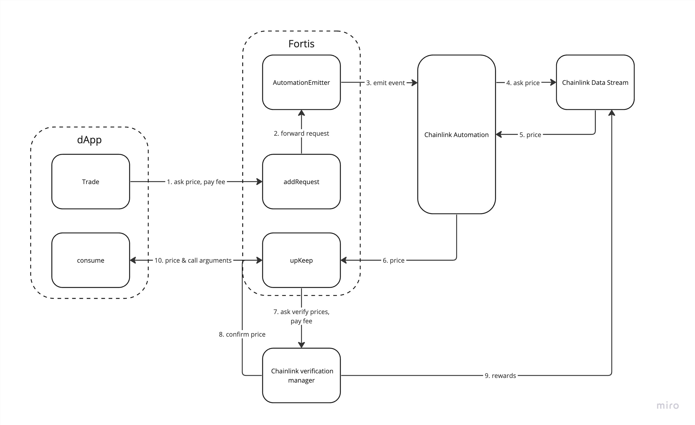
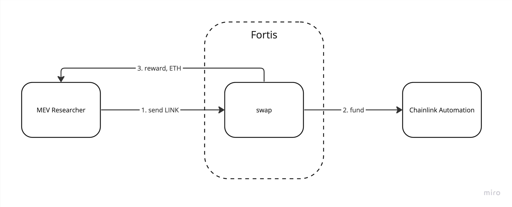

# Fortis Oracle

- [About](#about)
  - [Features](#features)
  - [Architecture](#architecture)
- [Development](#development)
  - [Requirements](#requirements)
  - [Quickstart](#quickstart)
  - [Testing](#testing)
  - [Deploying](#deploying)
  - [Deploying](#deploying)
  - [Deploying](#deploying)
- [Contributing](#contributing)
- [Resources](#resources)

## About

Fortis Oracle leverages Chainlink infrastructure (Data Streams and Data Feeds) and provides simple and useful Oracle for next-level high-performant dApps.

### Features

- Safe Requests Processing.
  - In case Chainlink Data Stream fails to deliver data within a predefined period of time, anyone can call a fallback method and deliver data collected from Chainlink Data Feeds. Keep the fallback method open, allows smooth and simple integration with AA tools.
- Simple Integration
  - While Chainlink provides highly customizable low-level API to build custom dApp oracles, Fortis Oracle focuses on reusability and simplicity, while preserving the benefits of Chainlink. To interact with Fortis Oracle, dApp should call the `AddRequest` method and implement the `Consume` method that will be called once price data is available.
- Pay for what you use.
  - Fortis Oracle charges a fee per request in ETH. The fee can be set by dApp based on total gas usage. It removes the necessity to deal with LINK\ETH conversion on the dApp level. Fortis Oracle uses an arbitrage-based approach to automatically convert collected ETH into LINK tokens and fund itself.

### Architecture

Base Flow.


Fallback.
After predefined period of time, in case Chainlink Automation does not process request, or provided price report is not valid (verification failed), anyone MEV searcher can trigger fallback logic. Payed fee for request processing then will be forwarded to MEV searcher.


Automated Refund.
Collected ETH from request fees can be exchanged to LINK by MEV searchers using `swap` method. This method automatically deposit LINK to Chainlink Automation Registry funding oracle operation with Data Streams.


## Development

### Requirements

- [Git](https://git-scm.com/book/en/v2/Getting-Started-Installing-Git)  
    -   You'll know you've done it right if you can run `git --version`
- [Foundry / Foundryup](https://github.com/gakonst/foundry)
    -   This will install `forge`, `cast`, and `anvil`
    -   You can test you've installed them right by running `forge --version` and get an output like: `forge 0.2.0 (f016135 2022-07-04T00:15:02.930499Z)`
    -   To get the latest of each, just run `foundryup`
- [Node.js](https://nodejs.org/en)
- Optional. [Docker](https://www.docker.com/)
    - You'll need to run docker if you want to use dev container and safely play with smartcontracts & scripts

### Quickstart

```sh
git clone git@github.com:killroy192/fortis.git
cd fortis
cp .env.example .env
make # This installs the project's dependencies.
```

### Testing

```sh
make test
```

### Deploying

Project leverage [@dgma/hardhat-sol-bundler](https://www.npmjs.com/package/@dgma/hardhat-sol-bundler) util dor deployment. Find more details for deployment in `deployment.config.js`
To deploy fortis oracle, run:

```sh
make deploy network=arbitrum-sepolia
```

The script will run and deploy only changed contracts. In case you need a fresh deployment, please remove `deployment-lock.js` file.
In case of new Oracle deployment, you will need to register it with [Chainlink automation log trigger](https://docs.chain.link/chainlink-automation/overview/getting-started#try-out-chainlink-automation).
After successful registration, you'll need to set Upkeep ID running:

```sh
# Oracle without demo modules
make onRegister network=arbitrum-sepolia id={your_upkeep_id} oracle=Oracle
# Oracle for demo 
make onRegister network=arbitrum-sepolia id={your_upkeep_id} oracle=FakedOracle
```

### Useful commands

To fund oracle with LINK tokens in exchange for collected ETH, run:

```sh
# Oracle without demo modules
make refund network=arbitrum-sepolia amount={link_tokens} oracle=Oracle
# Oracle for demo 
make refund network=arbitrum-sepolia amount={link_tokens} oracle=FakedOracle
```

To trade ETH\fUSDC with [SwapAPP](https://github.com/killroy192/fortis/blob/main/src/example/SwapApp.sol), run:

```sh
make trade-demo network=arbitrum-sepolia amount={eth_to_trade}
```

*note:* SwappApp and trade script charges fixed 0.00025 ETH fee for trade, modify `trade.task.js` if needed.

## Contributing

Contributions are always welcome! Open a PR or an issue!

Please install the following:

And you probably already have `make` installed... but if not [try looking here.](https://askubuntu.com/questions/161104/how-do-i-install-make)

## Resources

- [Chainlink Documentation](https://docs.chain.link/)
- [Foundry Documentation](https://book.getfoundry.sh/)
- [Hardhat Documentation](https://hardhat.org/docs)
